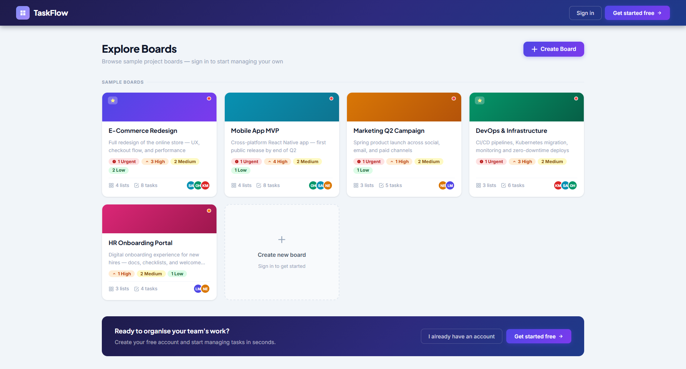
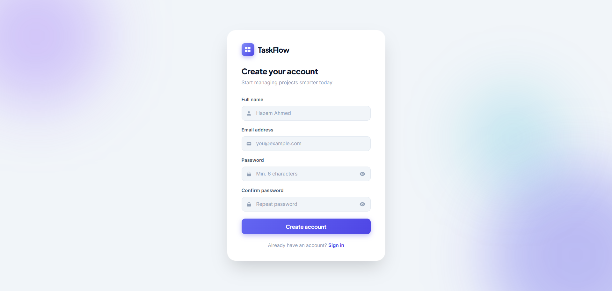
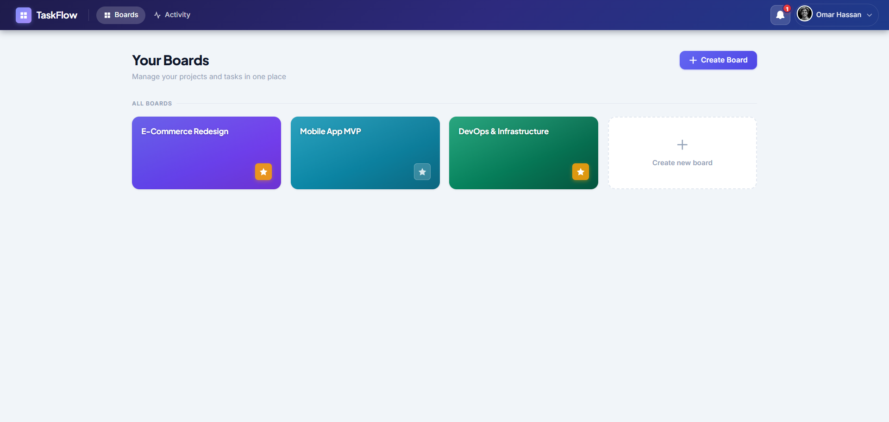
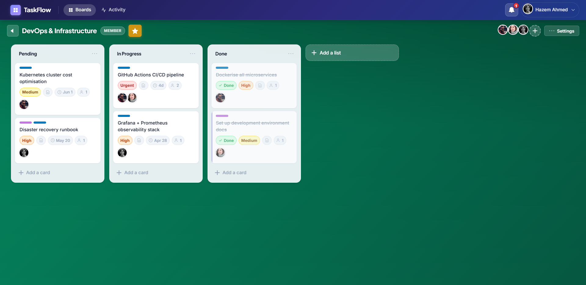
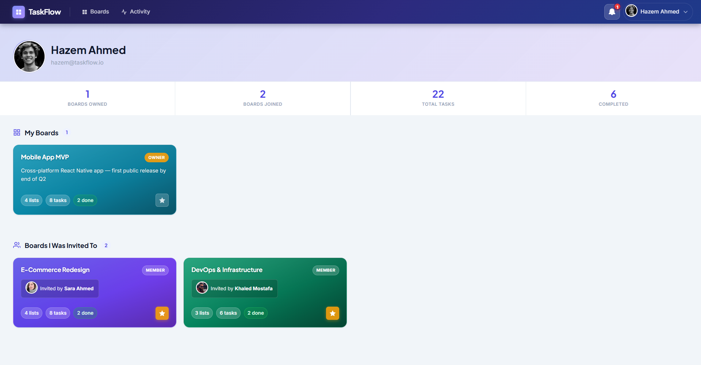

## Taskflow - Task Management System (Angular 17+)
## Live Preview 
https://task-flow-dffc7.web.app/

TaskFlow is a modern trello-inspired task management system built with **Angular 17+ (standalone components)**. It includes **authentication & authorization (demo accounts)**, **drag & drop**, **notifications**, and a clean, modern UI.


## Screenshots

### 1) Index (Landing) Page



### 2) Registration Page



### 3) Boards Page



### 4) Inside a Board (Lists + Cards)



### 5) Profile Page



### Build for Production

```bash
npm run build
```


## Quick Start

### Prerequisites
- Node.js 18+
- npm 9+

### Installation & Run

```bash
# Install dependencies
npm install

# Start development server
npm start
```

Open your browser at `http://localhost:4200` (or the next available port if 4200 is busy).


## How to Use

### Managing Boards
1. **Create Board**: Click "Create New Board" button on home page
2. **Edit Board**: Click pencil icon on board card
3. **Star Board**: Click star icon to mark as favorite
4. **Open Board**: Click on any board card to view details

### Working with Lists
1. **Add List**: Click "Add List" button on board page
2. **Edit List**: Click list title to edit inline
3. **Reorder Lists**: Drag and drop lists horizontally
4. **Delete List**: Click trash icon on list

### Managing Cards
1. **Create Card**: Click "Add Card" in any list
2. **Edit Card**: Click on card to open details modal
3. **Move Cards**: Drag cards between lists or within same list
4. **Set Priority**: Choose Low, Medium, High, or Urgent in card details
5. **Set Deadline**: Click date picker in card details
6. **Assign Users**: Search and add users to cards
7. **Add Comments**: Type in comment box in card details

### Notifications
- Click bell icon (top right) to view notifications
- Badge shows unread count
- Click notification to mark as read
- "Clear All" to dismiss all notifications

### User Features
- Search users by name
- View user avatars
- Add/remove board members
- Assign multiple users to cards

## Key Features

✔ Authentication & authorization (demo accounts with unified user role)  
✔ Fake database seeded from TypeScript + persisted in localStorage  
✔ Drag & drop lists and cards  
✔ Board management with custom colors  
✔ Card priorities and deadlines  
✔ User collaboration (members + card assignment)  
✔ In-app notifications center  
✔ Comments and descriptions  
✔ Activity log  
✔ Profile page (boards overview)  
✔ Responsive design  

## Tech Stack

- **Framework**: Angular +17 (Standalone Components)
- **Language**: TypeScript 5.2
- **Drag & Drop**: Angular CDK
- **State Management**: RxJS BehaviorSubjects
- **Routing**: Angular Router + functional guards (`authGuard`, `noAuthGuard`)
- **Persistence (Fake Backend)**: TypeScript seed data + localStorage (`DatabaseService`)
- **Auth**: Session stored in localStorage (`AuthService`)
- **Styling**: SCSS (design tokens, modern components, animations)

## Demo Accounts

Use any of these accounts on the login page:

- `hazem@taskflow.io` / `hazem123`
- `sara@taskflow.io` / `sara123`
- `nour@taskflow.io` / `nour123`
- `khaled@taskflow.io` / `khaled123`
- `lina@taskflow.io` / `lina123`

## Notes

- **Fresh seed data**: to reset to the seeded database, clear `taskflow_db_v2` from browser localStorage.
- **Logout/reset session**: you can also clear `taskflow_session`.