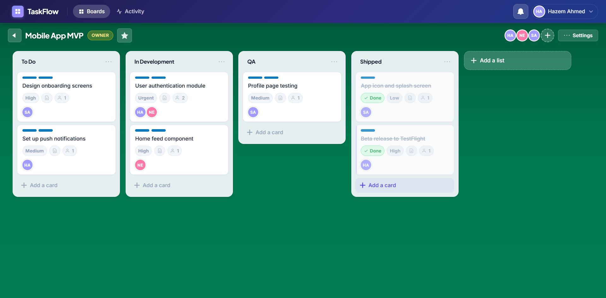
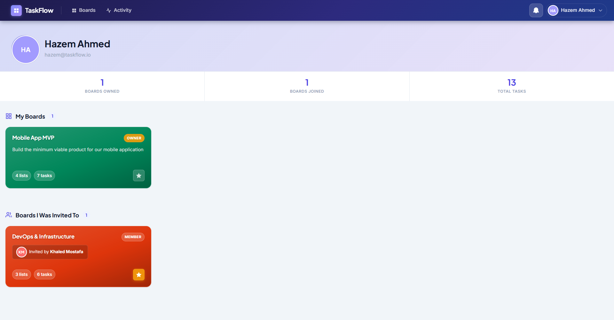

<div align="center">

# TaskFlow — Task Management System

**A full-stack Trello-inspired task management platform**  
Built with Angular 21 on the frontend and .NET 10 Clean Architecture on the backend.

---

### Frontend Stack

[](https://angular.dev)
[](https://www.typescriptlang.org)
[](https://rxjs.dev)
[](https://sass-lang.com)
[](https://material.angular.io/cdk)

### Backend Stack

[](https://dotnet.microsoft.com)
[](https://learn.microsoft.com/en-us/dotnet/csharp)
[](https://www.microsoft.com/sql-server)
[](https://learn.microsoft.com/en-us/ef/core)
[](https://jwt.io)
[](https://github.com/jbogard/MediatR)

### DevOps

[](https://docs.docker.com/compose)

</div>

---

## Screenshots

### Landing Page


### Board Details


### My Profile


---

## Features

| Feature | Description |
|---|---|
| **Authentication** | JWT-based login & registration with secure password hashing (BCrypt) |
| **Board Management** | Create, edit, delete, and star boards with custom background colors |
| **Lists & Cards** | Drag-and-drop lists and cards via Angular CDK |
| **Card Details** | Priority levels, deadlines, labels, descriptions, and completion notes |
| **Collaboration** | Invite members to boards, assign multiple users to cards |
| **Notifications** | In-app notification center with unread count badge |
| **Activity Log** | Full audit trail of all actions per board and globally |
| **Profile Page** | Overview of owned boards, invited boards, and task stats |
| **Responsive UI** | Mobile-friendly layout with smooth animations |

---

## Architecture

### Backend — Clean Architecture + Vertical Slices

The backend follows **Clean Architecture** with **Vertical Slice Architecture** inside the Application layer — each feature is fully self-contained.

```
backend/TaskManagement/
├── TaskManagement.Domain/           # Entities, Enums (no dependencies)
│   ├── Entities/                    # User, Board, List, Card, Comment, Activity...
│   └── Enums/                       # Priority, NotificationType, ActivityAction
│
├── TaskManagement.Application/      # Use-cases, DTOs, CQRS (depends on Domain only)
│   ├── Features/
│   │   ├── Auth/Commands/           # Login, Register
│   │   ├── Boards/Queries|Commands/ # GetAll, GetById, Create, Update, Delete, Star...
│   │   ├── Cards/Queries|Commands/  # GetById, Create, Update, Move, Assign, Complete
│   │   ├── Lists/Commands/          # Create, Update, Delete, Reorder
│   │   ├── Users/Queries/           # GetAll, GetById, Search
│   │   ├── Notifications/           # GetByUser, MarkRead, MarkAllRead
│   │   └── Activity/Queries/        # GetAll, GetByBoard
│   ├── DTOs/                        # BoardSummaryDto, CardDto, UserDto...
│   └── Common/                      # IApplicationDbContext, ValidationBehavior
│
├── TaskManagement.Infrastructure/   # EF Core, JWT, BCrypt (depends on Domain + Application)
│   ├── Persistence/
│   │   ├── TaskManagementDbContext.cs
│   │   └── DbInitializer.cs         # Seeds 5 demo users + sample boards/cards
│   └── Services/
│       ├── JwtTokenService.cs
│       └── PasswordService.cs
│
└── TaskManagement.Api/              # ASP.NET Core Web API (depends on Application + Infrastructure)
    ├── Controllers/                 # AuthController, BoardsController, CardsController...
    └── Program.cs                   # JWT auth, CORS, Swagger, DI wiring
```

**Patterns used:**
- **CQRS** via MediatR — every operation is an explicit Command or Query
- **Vertical Slices** — each feature folder contains its own Command/Query/Handler/Validator
- **Repository abstraction** — `IApplicationDbContext` keeps handlers decoupled from EF Core
- **Pipeline behaviors** — FluentValidation runs automatically before every handler

---

### Frontend — Angular 21 Modern Patterns

The frontend uses the latest Angular APIs throughout — no legacy patterns.

```
frontend/src/app/
├── core/
│   ├── models/          # TypeScript interfaces matching backend DTOs
│   ├── services/        # Signal-based services (boards, cards, auth, notifications...)
│   ├── guards/          # Functional auth guards (authGuard, noAuthGuard)
│   └── interceptors/    # auth.interceptor — attaches JWT Bearer token to every request
├── features/
│   ├── auth/            # Login, Register
│   ├── boards/          # Board list, Board detail, Board content
│   ├── cards/           # Card item, Card detail modal
│   ├── lists/           # List item with inline editing
│   ├── notifications/   # Notification center
│   ├── activity/        # Activity log
│   └── profile/         # User profile page
└── shared/              # Button, Avatar, Modal, Dropdown reusable components
```

**Patterns used:**

| Pattern | Usage |
|---|---|
| `signal()` / `computed()` | All reactive state in services and components |
| `input()` / `output()` | Component props replace `@Input()` / `@Output()` |
| `@if` / `@for` / `@switch` | New block syntax replaces `*ngIf` / `*ngFor` |
| `inject()` | Dependency injection replaces constructor injection |
| `ChangeDetectionStrategy.OnPush` | Applied to every component for performance |
| `effect()` | Side-effects triggered by signal changes (replaces `ngOnChanges`) |
| Functional interceptor | `authInterceptor` attaches JWT without a class-based interceptor |
| `HttpClient` only | Zero localStorage for state — everything talks to the REST API |

---

## API Reference

The backend exposes a full REST API documented via **Swagger UI** at `/swagger`.

| Group | Endpoints |
|---|---|
| **Auth** | `POST /api/auth/login` · `POST /api/auth/register` |
| **Users** | `GET /api/users` · `GET /api/users/{id}` · `GET /api/users/search?q=` · `GET /api/users/me` |
| **Boards** | `GET/POST /api/boards` · `GET/PUT/DELETE /api/boards/{id}` · `PUT /api/boards/{id}/star` |
| **Members** | `POST /api/boards/{id}/members` · `DELETE /api/boards/{id}/members/{userId}` |
| **Lists** | `GET/POST /api/boards/{boardId}/lists` · `PUT/DELETE /api/lists/{id}` · `PUT /api/boards/{boardId}/lists/reorder` |
| **Cards** | `GET/POST /api/lists/{listId}/cards` · `GET/PUT/DELETE /api/cards/{id}` · `PUT /api/cards/{id}/move` · `PUT /api/cards/{id}/complete` |
| **Assignees** | `POST/DELETE /api/cards/{id}/assignees/{userId}` |
| **Notifications** | `GET /api/notifications` · `PUT /api/notifications/{id}/read` · `PUT /api/notifications/read-all` |
| **Activity** | `GET /api/activity` · `GET /api/boards/{boardId}/activity` |

All endpoints except `auth/login` and `auth/register` require a `Bearer` token.

---

## Getting Started

### Option 1 — Docker Compose (recommended)

**Prerequisites:** Docker Desktop

```bash
# 1. Clone the repository
git clone <repo-url>
cd TASKFLOW-Task-management-system

# 2. Copy the environment file and edit if needed
cp .env.example .env

# 3. Start everything (SQL Server + backend + frontend)
docker compose up --build
```

| Service | URL |
|---|---|
| Frontend | http://localhost:4200 |
| Backend API | http://localhost:5034/api |
| Swagger UI | http://localhost:5034/swagger |
| SQL Server | localhost:1433 |

> SQL Server may take ~30 seconds on first start. The backend waits for it automatically.

---

### Option 2 — Local Development

**Prerequisites:** .NET 10 SDK · Node.js 22+ · SQL Server (LocalDB or full)

#### Backend

```bash
cd backend/TaskManagement/TaskManagement.Api

# Edit appsettings.Development.json with your connection string and JWT secret
# (see appsettings.Development.json — it is gitignored so safe to put secrets there)

dotnet run
# API: https://localhost:7207   Swagger: https://localhost:7207/swagger
```

The database is created and seeded automatically on first run (`EnsureCreated` + `DbInitializer`).

#### Frontend

```bash
cd frontend

npm install --legacy-peer-deps
ng serve
# App: http://localhost:4200
```

---

## Environment Variables

All secrets live in `.env` (gitignored). Copy `.env.example` to get started.

| Variable | Used by | Description |
|---|---|---|
| `DB_SA_PASSWORD` | Docker / SQL Server | SA password for the SQL Server container |
| `DB_CONNECTION_STRING` | Backend | Full ADO.NET connection string |
| `JWT_SECRET` | Backend | HMAC-SHA256 signing key (min 32 chars) |
| `JWT_ISSUER` | Backend | JWT `iss` claim |
| `JWT_AUDIENCE` | Backend | JWT `aud` claim |
| `JWT_EXPIRY_MINUTES` | Backend | Token lifetime in minutes |
| `FRONTEND_API_URL` | Frontend (Docker build) | Base URL the Angular app uses to reach the API |

---

## Demo Accounts

These accounts are seeded automatically on first run:

| Name | Email | Password |
|---|---|---|
| Hazem Ahmed | `hazem@taskflow.io` | `hazem123` |
| Sara Mostafa | `sara@taskflow.io` | `sara123` |
| Nour Ali | `nour@taskflow.io` | `nour123` |
| Khaled Hassan | `khaled@taskflow.io` | `khaled123` |
| Lina Youssef | `lina@taskflow.io` | `lina123` |

---

## Project Structure

```
TASKFLOW-Task-management-system/
├── .env                    # Local secrets (gitignored)
├── .env.example            # Template — copy to .env
├── docker-compose.yml      # Full-stack Docker setup
├── backend/
│   └── TaskManagement/
│       ├── Dockerfile
│       ├── TaskManagement.sln
│       ├── TaskManagement.Api/
│       ├── TaskManagement.Application/
│       ├── TaskManagement.Domain/
│       ├── TaskManagement.Infrastructure/
│       └── TaskManagement.Tests/
├── frontend/
│   ├── Dockerfile
│   ├── nginx.conf
│   └── src/
│       └── app/
│           ├── core/        # Models, services, guards, interceptors
│           ├── features/    # Auth, boards, cards, lists, profile, notifications
│           └── shared/      # Reusable UI components
└── docs/
    └── screenshots/         # Add your screenshots here
```
